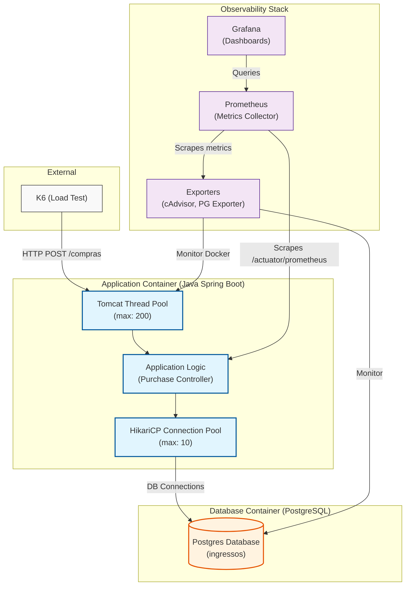

# System Architecture: Naive Solution

This diagram visualizes the "Naive Solution" (Robust approach) currently implemented in `bloco-1`.

### Key Components

1.  **K6 (External)**: Generates high-concurrency traffic to simulate a real-world ticket sale event.
2.  **Tomcat (Web Server)**: Manages incoming HTTP requests. The thread pool size (default 200) determines how many requests can be *processed* simultaneously.
3.  **HikariCP (Connection Pool)**: Manages a pool of active connections to PostgreSQL. With a limit of 10, it acts as a throttle, preventing the application from overwhelming the database.
4.  **PostgreSQL (Database)**: Relies on "Skip Locked" row-level locking to ensure data consistency during concurrent purchases.
5.  **Observability Stack**:
    *   **Prometheus**: Periodically pulls metrics from the application (via Actuator) and infrastructure (via exporters).
    *   **Grafana**: Provides the visual interface to analyze the relationship between traffic, thread usage, pool saturation, and database performance.
