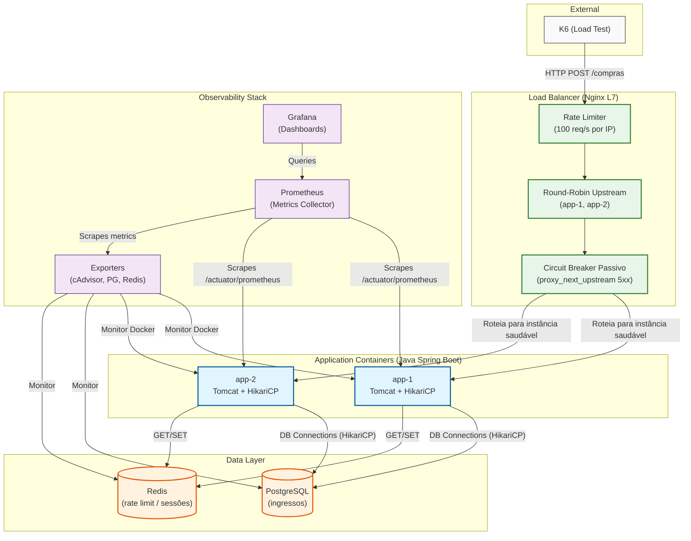

# System Architecture: Robust Solution

Esta infraestrutura evolui a `infra-ingenua` introduzindo um **Load Balancer Nginx L7**,
**2 réplicas da aplicação** e **Redis**, aumentando a capacidade de throughput e resiliência.

---

### Key Components

1. **K6 (External)**: Gera tráfego de alta concorrência para simular uma venda real de ingressos.

2. **Nginx (L7 Load Balancer)**: Ponto de entrada único. Responsável por:
    - **Round-Robin**: distribui requests alternando entre `app-1` e `app-2`.
    - **Rate Limiting**: bloqueia com `429` IPs que excedam 100 req/s (com burst de 50).
    - **Circuit Breaker Passivo**: se uma instância retornar 5xx, a request atual é
      redirecionada automaticamente para a outra instância via `proxy_next_upstream`.
    - **Header `X-Served-By`**: identifica qual instância respondeu — essencial para depuração e validação pelo K6.

3. **app-1 / app-2 (Spring Boot)**: Duas instâncias do mesmo serviço, sem porta pública.
   Todo tráfego chega obrigatoriamente via Nginx.

4. **PostgreSQL**: Banco único (Single-Primary). Usa `SELECT ... FOR UPDATE SKIP LOCKED`
   para garantir que nenhum ingresso seja vendido duas vezes mesmo com múltiplas instâncias
   concorrendo pela mesma linha.

5. **Redis**: Infraestrutura para Rate Limiting distribuído consistente entre instâncias.
   Com múltiplas réplicas da app, o Rate Limiter **precisa** de um estado compartilhado —
   se fosse em memória local de cada instância, o limite seria 2x o esperado.

6. **Observability Stack**:
    - **Prometheus**: coleta métricas de `app-1`, `app-2`, `postgres-exporter`, `redis-exporter` e `cadvisor`, com label `instance` distinto por réplica.
    - **Grafana**: painéis para visualizar distribuição de carga, JVM por instância, pool saturation e Redis.
    - **Exporters**: `cAdvisor` (Docker), `postgres-exporter` (Postgres), `redis-exporter` (Redis).

---

### Decision Records

#### DR-01: Por que Nginx L7 e não L4?

Escolhemos **L7 (HTTP)** porque o contexto do estudo exige inspecionar o conteúdo HTTP:

| Capacidade | L4 | L7 (escolhido) |
|---|---|---|
| Rate Limiting por IP | ❌ | ✅ (`limit_req_zone`) |
| Circuit Breaker (analisa 5xx) | ❌ | ✅ (`proxy_next_upstream`) |
| Health check semântico (`/health`) | ❌ | ✅ |
| Header de diagnóstico | ❌ | ✅ (`X-Served-By`) |

#### DR-02: Por que 2 instâncias nomeadas (`app-1`, `app-2`) e não `deploy.replicas: 2`?

Com `deploy.replicas`, o Docker Compose cria containers com nomes dinâmicos (ex: `app-1`, `app-2`
ou `bloco1-app-1` etc.) e **não permite definir targets estáticos no Prometheus**. Com instâncias
nomeadas fixas podemos:
- Scrape cada instância individualmente com `label: instance: 'app-1'` no Prometheus.
- Criar painéis Grafana filtrados por instância (ex: JVM Heap de `app-1` vs `app-2`).
- Validar a distribuição no K6 via header `X-Served-By`.

#### DR-03: Por que um `prometheus.yml` local e não o `shared/observability/prometheus.yml`?

O `shared/prometheus.yml` aponta para um único target `app:8080`. Com 2 instâncias, precisamos
de 2 targets com labels distintos (`instance: app-1` e `instance: app-2`). Manter um arquivo
local evita que a mudança quebre a `infra-ingenua`, que ainda usa o `shared/`.

#### DR-04: Por que PostgreSQL Single-Primary? E quando adicionar réplica de leitura?

Para o desafio de consistência (não vender o mesmo ingresso duas vezes), **todas as escritas
precisam ir ao mesmo nó**. Uma réplica de leitura faria sentido se houvesse consultas pesadas
de leitura separadas das escritas. Neste cenário (`/compra` é sempre uma operação de escrita),
uma réplica não reduz a contenção.

Quando adicionar: ao introduzir endpoints de consulta pesada (ex: `/historico-compras`),
usar a réplica para reads aliviaria o primário.
