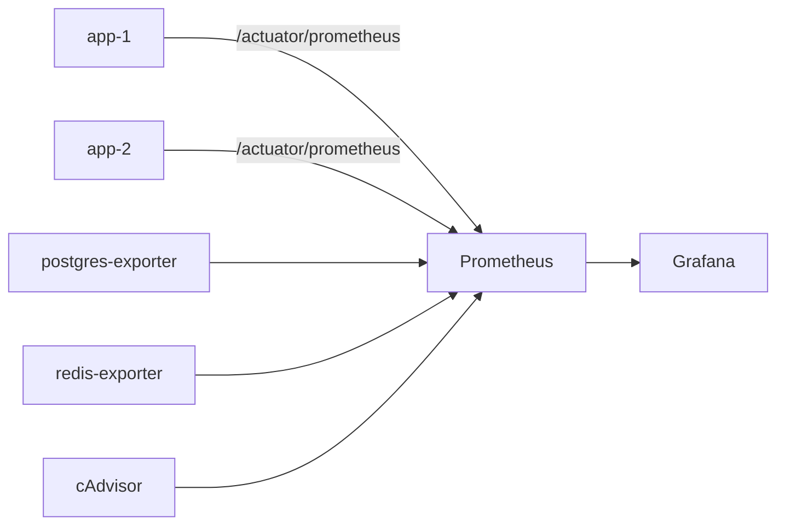

# Evoluindo a Observabilidade

> Este documento é um roadmap de evolução da observabilidade para a `infra-robusta`.
> O objetivo é registrar o que vem depois, sem implementar agora — cada item aqui será
> o tema de um momento dedicado de estudo.

---

## Onde estamos hoje (`infra-robusta`)



### O que conseguimos observar agora

| Sinal | Fonte | Ferramenta |
|---|---|---|
| JVM Heap, Threads, GC | `/actuator/prometheus` | Grafana |
| HTTP request rate, latência | `/actuator/prometheus` | Grafana |
| CPU/Memória por container | cAdvisor | Grafana |
| Conexões e queries do Postgres | postgres-exporter | Grafana |
| Comandos e memória do Redis | redis-exporter | Grafana |

### Limitação atual

Temos **métricas** (números agregados no tempo), mas **não temos**:
- ❌ **Logs centralizados**: cada container loga no seu stdout separadamente — impossível correlacionar erros entre `app-1` e `app-2`.
- ❌ **Traces distribuídos**: quando uma request passa por Nginx → app → Redis → Postgres, não conseguimos ver o tempo gasto em cada etapa.

---

## Próximo Passo 1: Logs Centralizados com Loki + Promtail

### O problema que resolve

Com 2 instâncias, um erro pode aparecer no log de `app-1` mas a requisição pode ter chegado
via `app-2`. Sem agregação, você precisa executar `docker logs app-1` e `docker logs app-2`
separadamente e correlacionar manualmente.

### Como funciona

```
app-1 (stdout) ──┐
                  ├─→ Promtail ──→ Loki ──→ Grafana (Explore → Logs)
app-2 (stdout) ──┘
```

- **Promtail**: agente que lê o stdout dos containers Docker e envia para o Loki.
- **Loki**: banco de dados de logs (indexa só metadados, não o conteúdo completo — muito mais barato que Elasticsearch).
- **Grafana**: já está instalado, basta adicionar Loki como datasource.

### O que adicionar ao docker-compose

```yaml
loki:
  image: grafana/loki:latest
  ports:
    - "3100:3100"

promtail:
  image: grafana/promtail:latest
  volumes:
    - /var/run/docker.sock:/var/run/docker.sock
    - ./promtail-config.yml:/etc/promtail/config.yml
```

### Por que é especialmente útil aqui

Ao rodar o teste de stress com K6, erros aparecem em ordem aleatória nos dois containers.
Com Loki + Grafana, você consegue ver **todos os logs juntos**, filtrar por `instance=app-1`
e correlacionar o momento exato de um erro 500 com a métrica de JVM heap daquele instante.

---

## Próximo Passo 2: Tracing Distribuído com Jaeger (OpenTelemetry)

### O problema que resolve

Métricas e logs dizem *o que* aconteceu. O trace diz *onde* a request passou e *quanto tempo*
levou em cada etapa. Com Nginx → app → Redis → Postgres, você quer saber:

> "A latência p99 subiu. Foi no Postgres? No Redis? Ou o Tomcat estava saturado?"

### Como funciona

```
K6 → Nginx → app-1 (cria Span) → Redis (Span filho) → Postgres (Span filho)
                 ↓
              Jaeger Agent → Jaeger Collector → Jaeger UI (http://localhost:16686)
```

- **OpenTelemetry Java Agent**: via `-javaagent`, intercepta automaticamente chamadas HTTP, JDBC e Redis sem modificar o código.
- **Jaeger**: recebe, armazena e visualiza os traces.

### O que adicionar ao docker-compose

```yaml
jaeger:
  image: jaegertracing/all-in-one:latest
  ports:
    - "16686:16686"  # UI
    - "4317:4317"    # OTLP gRPC
```

E nas instâncias da app:
```yaml
environment:
  - OTEL_EXPORTER_OTLP_ENDPOINT=http://jaeger:4317
  - OTEL_SERVICE_NAME=venda-ingressos
```

### Por que é o tema do Bloco 5 do plano

O `plano-1.md` trata Jaeger + OpenTelemetry no Bloco 5 ("Observabilidade e Profiling Distribuído").
Introduzir um gostinho aqui no Bloco 1 já cria o contexto para quando chegar lá.

---

## Próximo Passo 3: Dashboard Nginx no Grafana

### O problema que resolve

Atualmente o Nginx não expõe métricas para o Prometheus. Sabemos a distribuição pelo K6
(via `X-Served-By`), mas não temos visibilidade em tempo real de:
- Quantas requests estão sendo rate-limited (429)?
- Qual a latência medida pelo próprio Nginx (antes de chegar na app)?
- Quantas conexões ativas o Nginx está gerenciando?

### Como implementar

O **nginx-prometheus-exporter** lê o endpoint `/nginx_status` (já configurado no `nginx.conf`)
e expõe as métricas no formato Prometheus:

```yaml
nginx-exporter:
  image: nginx/nginx-prometheus-exporter:latest
  command: --nginx.scrape-uri=http://nginx:8080/nginx_status
  ports:
    - "9113:9113"
```

Com isso, é possível criar um dashboard Grafana mostrando:
- `nginx_connections_active` — conexões ativas
- `nginx_http_requests_total` — total de requests por status code
- Taxa de 429 ao longo do tempo (evidência do Rate Limiter em ação)
